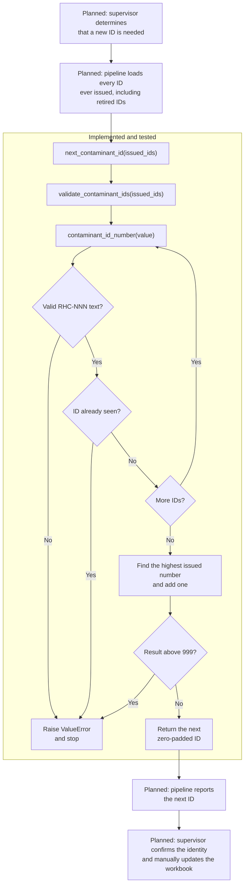

# Immutable Contaminant Identifier

The immutable contaminant identifier component validates permanent Red Hill
contaminant IDs and calculates the next ID when a new one must be issued.

## Status

The identifier functions and their unit tests are implemented. They currently
run only when called directly by Python code or tests; they are not yet
connected to the command-line interface, Excel workbooks, or the release
pipeline.

Contaminant identifiers use the three-digit `RHC-NNN` format, from `RHC-001`
through `RHC-999`.

## Problem this component solves

Compound names, scientific fields, and workbook row positions can change. A
permanent ID lets the pipeline recognize the same contaminant across releases
without relying on its name or row number.

The component also prevents malformed IDs, duplicate IDs, and reuse of a
retired ID when the permanent registry is supplied correctly.

The exact format and lifecycle rules are defined in the
[data contract](../data_contract.md).

## When it is used

| Situation | How the component is used |
| --- | --- |
| Initial bootstrap | Validate the `RHC-001` through `RHC-152` identifiers. |
| Routine release | Validate identifier format and uniqueness once release integration exists. |
| New contaminant | Calculate the number after the highest ID ever issued. |
| Split or corrected chemical identity | Calculate new IDs after scientific review determines that new records are required. |
| Retirement | Do not issue an ID solely because of retirement; retain the retired ID in the registry so it cannot be reused. |
| Rename or row reorder | Keep the existing ID. No new ID is calculated. |

## Place in the pipeline

Phase 0A defines the ID contract. Phase 0B will use tested package code to
propose the initial mapping from the July workbook's legacy IDs to `RHC-001`
through `RHC-152`. Later validation, comparison, reference joining, and app
export will use approved IDs as stable keys.

The following diagram shows the full allocation path. The middle section is
implemented and tested now. The supervisor and pipeline steps around it are
planned integration work.



GitHub and the public website do not participate in this component. They will
consume validated release data in later phases.

## Realistic example

Assume the future permanent registry contains every ID through `RHC-152`,
including any that have been retired.

During validation:

```python
contaminant_id_number("RHC-152")
```

returns the number `152`. It confirms and interprets the existing ID; it does
not create a new one.

When a new contaminant needs an ID:

```python
next_contaminant_id(["RHC-001", "RHC-025", "RHC-152"])
```

returns `RHC-153`. Input order and gaps do not matter because allocation uses
the highest ID ever issued. The result is only a proposed value until a
supervisor confirms the chemical identity and manually updates the
authoritative workbook.

## Inputs and outputs

| Function | Receives | Returns |
| --- | --- | --- |
| `contaminant_id_number` | One value of any type | The numeric portion of a valid ID, such as `152` |
| `validate_contaminant_ids` | A collection of ID values | The same valid, unique IDs as an ordered tuple |
| `next_contaminant_id` | Every ID ever issued, including retired IDs | The next zero-padded ID, such as `RHC-153` |

None of these functions modifies its input, a registry, or an Excel workbook.

## Successful allocation

1. `next_contaminant_id` passes the supplied registry IDs to
   `validate_contaminant_ids`.
2. `validate_contaminant_ids` calls `contaminant_id_number` for each value and
   rejects duplicates.
3. `next_contaminant_id` finds the highest numeric portion and adds one.
4. It confirms that the result does not exceed 999.
5. It returns the result as `RHC-NNN` text.

## Validation and failure behavior

| Problem | Result |
| --- | --- |
| The value is not text | `ValueError`: contaminant ID must be text |
| The value is not exactly uppercase `RHC-NNN` | `ValueError`: contaminant ID must have the form `RHC-NNN` |
| The value is `RHC-000` | `ValueError`: `RHC-000` is not valid |
| The same ID appears twice | `ValueError` naming the duplicate ID |
| `RHC-999` has already been issued | `ValueError`: the ID range is exhausted |

An error stops the operation before an ID is returned. The component has no
workbook-writing behavior, so a failure cannot partially update an
authoritative workbook.

## Responsibilities and safety boundaries

| Actor | Responsibility |
| --- | --- |
| Identifier component | Validate ID syntax and uniqueness; calculate the next available number. |
| Future pipeline integration | Load the complete permanent registry, call these functions, and report results. |
| Supervisor or scientific reviewer | Decide whether a contaminant is new, retired, merged, split, or corrected to a different identity; approve proposed IDs. |
| GitHub and website | No current role in this component. |

The component deliberately does not:

- Decide whether two records represent the same chemical.
- Decide whether a merge, split, or identity change is scientifically correct.
- Match an ID to a contaminant name, CASRN, or InChIKey.
- Maintain the permanent ID registry.
- Read or write Excel workbooks.
- Publish data or change website routes.

## Current limitations and planned integration

The project does not yet have the permanent registry that maps each ID to its
contaminant and lifecycle status. Phase 0B will generate the initial mapping;
the supervisor will incorporate reviewed changes into the workbooks manually.

Later components must connect these functions to workbook reading, reference
validation, release comparison, and app export. Until then, callers are
responsible for supplying a complete list of active and retired IDs.

## Implementation and tests

The implementation is in
[`identifiers.py`](../../src/contaminant_pipeline/identifiers.py). Focused tests
are in [`test_identifiers.py`](../../tests/test_identifiers.py).

The seven tests prove that:

- `RHC-001`, `RHC-152`, and `RHC-999` are accepted and converted to numbers.
- Zero, incorrect widths, lowercase text, whitespace, numeric values, and blank
  values are rejected.
- Duplicate IDs are rejected.
- An empty registry starts at `RHC-001`.
- Allocation uses the highest issued ID rather than list order or gaps.
- Retired IDs remain reserved when they are included in the registry.
- Allocation stops after `RHC-999`.

Run the focused tests from the repository root with:

```powershell
$env:PYTHONPATH='data_pipeline\src'
python -m unittest discover -s data_pipeline\tests -v
```
